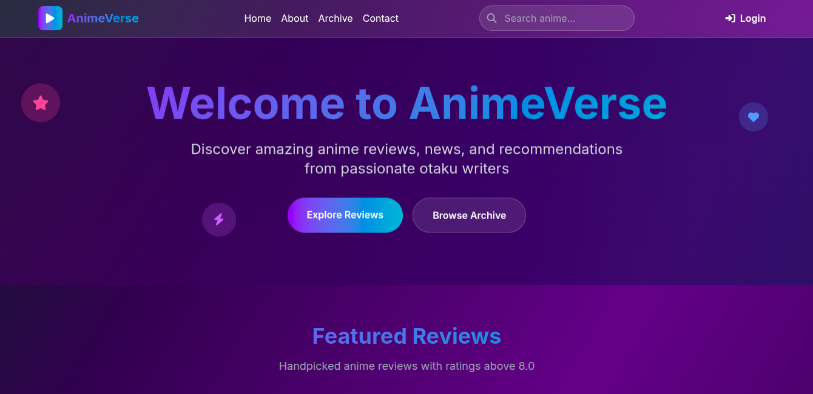

# AnimeVerse Blog

[🌐 Live Site](https://blog-c7sz.onrender.com)

AnimeVerse is a blog platform built with Django where anime fans can explore reviews, recommendations, and updates from the anime world.  
It’s designed to provide a clean and engaging reading experience while celebrating anime culture.  

---

## ✨ Features

- 📰 **Anime Blog Posts** – Reviews, recommendations, and news articles.  
- 📚 **Pagination** – Easy browsing of posts across pages.  
- 📱 **Responsive Design** – Works on desktop, tablet, and mobile.  
- 🔐 **Admin Dashboard** – Manage blog posts securely through Django’s admin panel.  
- 📂 **Media & Images** – Support for anime-related images and banners.  
- ⚡ **Deployed on Render** – Stable cloud hosting with PostgreSQL database.  

---

## 🎯 Purpose

AnimeVerse was created to:  
- Share anime thoughts and recommendations with fans worldwide.  
- Build a hub for anime lovers to explore new and classic titles.  
- Serve as a portfolio project showcasing a full-stack Django blog.  

---

## 🛠️ Tech Stack

- **Backend**: Django (Python)  
- **Database**: PostgreSQL (Render)  
- **Frontend**: Django Templates, HTML5, CSS3, TailWind 
- **Hosting**: Render  
- **Static Files**: Whitenoise  

---

## 📌 Future Roadmap

- 💬 Add comments on posts  
- 🔎 Add search and tag-based filtering  
- 🌙 Add dark mode for better anime vibes  
- 👤 Enable user profiles and custom avatars  

---

## 📸 Screenshots 

